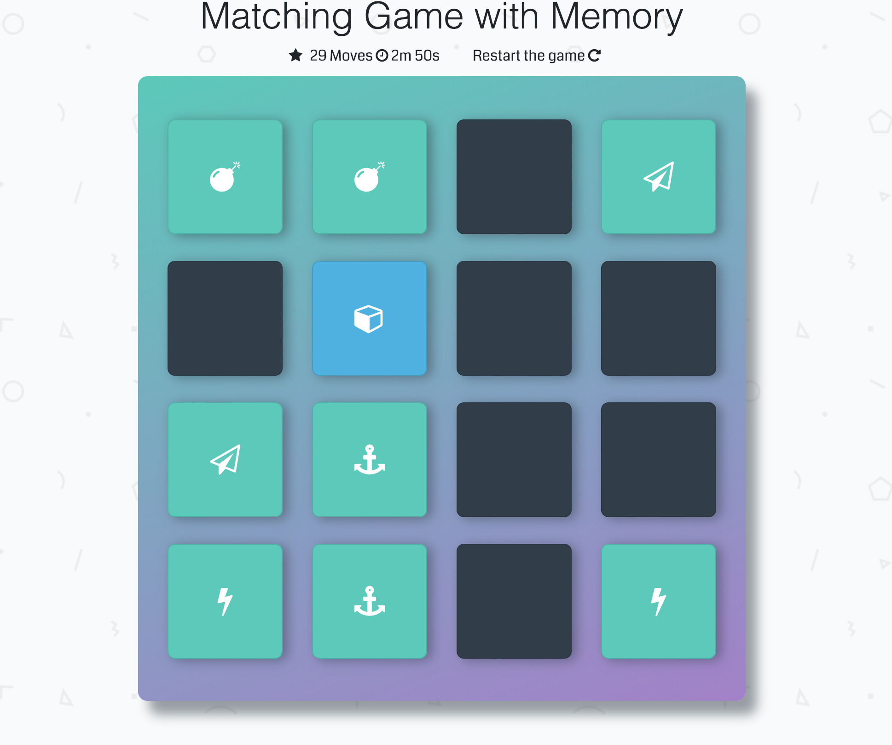

# Memory Game (Udacity Project)
This is the second project from Udacity Front-end Development Nanodegree.

## What is a Memory Game
It is a simple game built to test the user memory. There's a deck of cards with different icons and the user should click the different card and remember theirs positions. 

## Game explanation
The objetive is to match the cards in the less time possible and with the less moves.

## How to Play
- Clone the repository using this command: `git clone https://github.com/cesar18pena/fend-project-memory-game.git`
- Open the index.html and start playing.

## Instructions
- Click on any card that you like
- Cards are going to reveal theirs icons, so start trying to remember the symbols in each card.
- Match the cards properly with the less moves as possible and as quick as you can.
